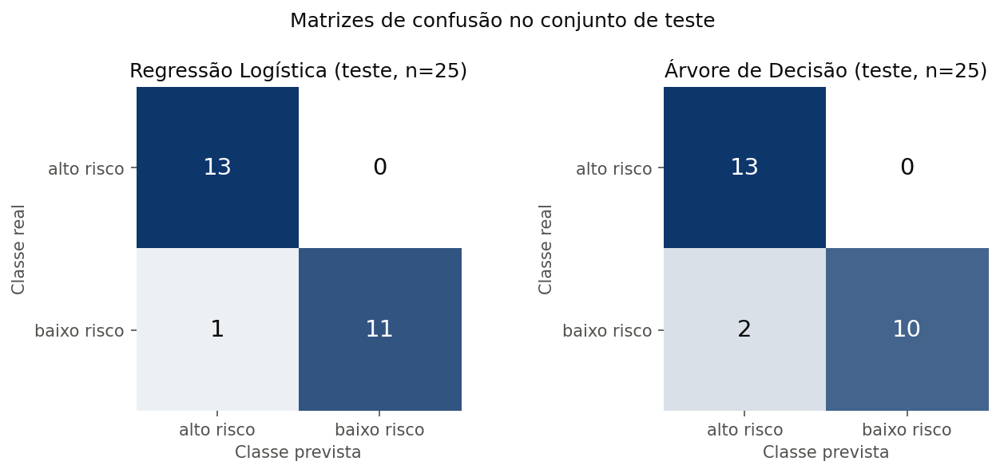
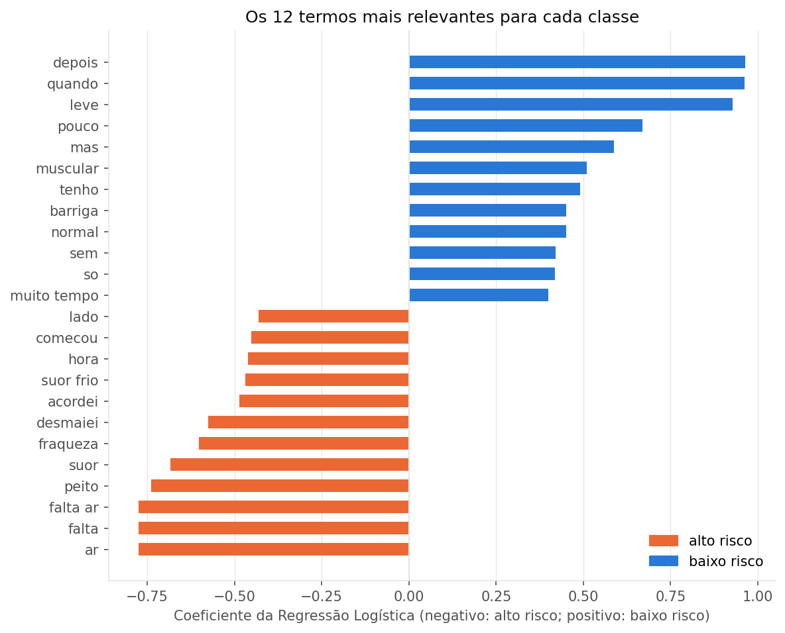

# AI Project Document - Fase 2 - FIAP

**CardioIA: Diagnóstico Automatizado, IA no Estetoscópio Digital**

## Grupo 69

#### Nomes dos integrantes do grupo

- Silvio Prestes Guerreiro Junior (RM567958)

Tutor: Leonardo Ruiz Orabona. Coordenador: André Godoi Chiovato. Curso de Inteligência Artificial, 2º ano, Fase 2, 2026.

## Sumário

[1. Introdução](#c1)

[2. Visão Geral do Projeto](#c2)

[3. Desenvolvimento do Projeto](#c3)

[4. Resultados e Avaliações](#c4)

[5. Conclusões e Trabalhos Futuros](#c5)

[6. Referências](#c6)

[Anexos](#c7)

<br>

# <a name="c1"></a>1. Introdução

## 1.1. Escopo do Projeto

### 1.1.1. Contexto da Inteligência Artificial

A Inteligência Artificial aplicada à saúde é um dos segmentos de maior crescimento da indústria de IA, com aplicações que vão da leitura automatizada de exames de imagem à previsão de risco a partir de prontuários e sinais de dispositivos vestíveis. Dentro desse segmento, o Processamento de Linguagem Natural (NLP) ocupa um lugar particular: grande parte da informação clínica nasce como texto livre, na fala do paciente, na anamnese e na evolução médica, e transformar esse texto em informação estruturada é o primeiro passo para qualquer apoio automatizado à decisão.

A abrangência é internacional, com produtos comerciais de triagem por sintomas e assistentes clínicos em uso em vários países, e nacional, com iniciativas de telessaúde e de regulação do SUS que dependem de triagem e priorização de atendimento. No Brasil, o contexto é marcado por duas restrições que este projeto leva em conta: a Lei Geral de Proteção de Dados (Lei nº 13.709/2018), que classifica dados de saúde como dados pessoais sensíveis, e a necessidade de que qualquer sistema de apoio preserve a decisão final com o profissional de saúde.

O CardioIA é um projeto acadêmico, desenvolvido por fases no método PBL, que simula o ecossistema de uma cardiologia moderna. A Fase 1 curou os dados (numéricos, textuais e visuais); a Fase 2, documentada aqui, constrói o primeiro módulo inteligente, de triagem por texto. Todo o trabalho usa dados simulados ou públicos e anonimizados, e nenhum artefato é ferramenta de diagnóstico real.

### 1.1.2. Descrição da Solução Desenvolvida

A solução é um módulo de apoio à triagem que recebe um relato curto de um paciente, em português brasileiro, e devolve três informações: os sintomas reconhecidos (e os negados), uma hipótese diagnóstica sugerida por um mapa de conhecimento sintoma-doença e um nível de risco (alto ou baixo) estimado por um classificador supervisionado, com a probabilidade associada.

Ela foi construída em duas partes, conforme o enunciado da fase. A Parte 1 é um sistema baseado em regras: dez relatos simulados de pacientes, um mapa de conhecimento com 67 associações entre expressões de sintomas e doenças e um extrator em Python puro que normaliza o texto, localiza as expressões por expressões regulares, trata negações simples e pontua cada doença pelo número de evidências encontradas. A Parte 2 é um classificador estatístico: uma base de 100 frases rotuladas como alto ou baixo risco, vetorização TF-IDF com unigramas e bigramas e uma Regressão Logística como modelo principal, comparada com Árvore de Decisão e Naive Bayes, avaliada por validação cruzada, conjunto de teste e frases inéditas. As duas partes se integram na função `triagem(frase)`.

O valor da solução, no contexto simulado do CardioIA, está em priorizar a fila de atendimento e em dar ao profissional um resumo estruturado do relato, com a hipótese e o risco já sugeridos e com as evidências explícitas (quais expressões foram encontradas, quais termos pesaram na decisão). A decisão permanece com o profissional.

# <a name="c2"></a>2. Visão Geral do Projeto

## 2.1. Objetivos do Projeto

- Criar dez relatos simulados de pacientes, em primeira pessoa, com o que o paciente sente, quando começou e como a rotina foi afetada.
- Construir um mapa de conhecimento sintoma-doença no formato exigido (`Sintoma 1,Sintoma 2,Doença Associada`), incluindo os exemplos do enunciado e vocabulário popular.
- Implementar um código de extração de informações que identifique os sintomas de cada relato e sugira um diagnóstico, com tratamento de negação e desempate documentados.
- Criar uma base rotulada de risco (`frase,situacao`, rótulos `alto risco` e `baixo risco`) com diversidade planejada e sem vazamento entre treino, teste e relatos.
- Treinar e testar um classificador de texto com TF-IDF, medindo acurácia, matriz de confusão, sensibilidade da classe de alto risco e comportamento em frases inéditas.
- Documentar vieses, justiça, enquadramento na LGPD e limitações, e publicar tudo em repositório público com README e vídeo de demonstração.

## 2.2. Público-Alvo

O público-alvo direto é a banca e os colegas da disciplina, que avaliam a aplicação dos conceitos de NLP baseado em regras e estatístico. No cenário simulado do CardioIA, os usuários finais seriam equipes de triagem e profissionais de saúde de uma clínica de cardiologia, que receberiam o resumo estruturado de cada relato para priorizar o atendimento, e, indiretamente, os pacientes, cujos relatos entram no sistema. O módulo não se destina a uso direto por pacientes nem a decisão autônoma.

## 2.3. Metodologia

O trabalho seguiu o método PBL da disciplina, organizado em módulos executados um por vez, cada um com entrega verificada por execução antes de ser documentado:

1. Inventário dos insumos da Fase 1 (dataset numérico UCI Cleveland, corpus textual e acervo de imagens) e do enunciado, com matriz de requisitos e rubrica.
2. Parte 1: redação dos relatos e do gabarito; construção do mapa de conhecimento e de sua versão estendida; implementação do extrator; validação de 10 em 10 diagnósticos e 29 em 29 sintomas esperados.
3. Parte 2: definição dos critérios de rotulagem; geração da base por script (nunca editada à mão), com validações de formato, balanceamento, duplicatas e vazamento; notebook com exploração, pré-processamento, TF-IDF, divisão estratificada 75/25, validação cruzada com 5 partições, três modelos, avaliação, interpretabilidade, testes comportamentais e integração com a Parte 1.
4. Governança: análise de vieses do dataset da Fase 1 e das bases sintéticas, justiça, LGPD e responsabilidade.
5. Documentação e publicação: README no modelo da FIAP, checklist contra a rubrica, roteiro de entrega e vídeo.

Princípios adotados: reprodutibilidade (`RANDOM_STATE = 42`, versões fixadas, caminhos relativos), nenhuma métrica escrita sem execução real, dados exclusivamente simulados ou públicos e anonimizados, e aviso permanente de uso acadêmico.

# <a name="c3"></a>3. Desenvolvimento do Projeto

## 3.1. Tecnologias Utilizadas

| Categoria | Tecnologia | Uso |
|---|---|---|
| Linguagem | Python 3.10 ou superior (executado com 3.11 e 3.14) | Todo o código |
| Biblioteca padrão | `re`, `unicodedata`, `csv`, `collections` | Extrator da Parte 1, sem dependências externas |
| Dados | pandas 3.0.2, numpy 2.4.4 | Carga, exploração e tabelas do notebook |
| Machine Learning | scikit-learn 1.8.0 | `TfidfVectorizer`, `LogisticRegression`, `DecisionTreeClassifier`, `MultinomialNB`, `Pipeline`, `StratifiedKFold`, `GridSearchCV`, métricas |
| Visualização | matplotlib 3.10.9 | Matrizes de confusão e termos relevantes |
| Persistência | joblib 1.5.3 | Modelo treinado em `src/models/modelo_risco.joblib` |
| Ambiente | Jupyter (VS Code), Google Colab como alternativa | Notebook executado de ponta a ponta |
| Versionamento | Git e GitHub, estrutura do modelo de repositório da FIAP | Publicação |

## 3.2. Modelagem e Algoritmos

**Extrator baseado em regras (Parte 1).** O texto é normalizado (minúsculas, remoção de acentos e pontuação) e as expressões do mapa de conhecimento são compiladas em expressões regulares com limite de palavra e tolerância a plural simples. Quando duas expressões se sobrepõem, prevalece a mais longa, para que a evidência mais específica conte uma única vez. Uma expressão precedida por "não", "sem", "nunca", "nenhum", "nenhuma" ou "nem" em janela de até três palavras é registrada como negada e não pontua. Cada doença recebe um ponto por expressão distinta encontrada; a de maior pontuação é a hipótese sugerida e os empates são apresentados em ordem alfabética. A abordagem foi escolhida por ser transparente e auditável, requisito central em apoio à decisão médica, e por atender literalmente ao enunciado.

**Classificador estatístico (Parte 2).** As frases são vetorizadas com TF-IDF (`ngram_range=(1, 2)`, `min_df=2`, `strip_accents="unicode"`, norma L2) com uma lista mínima de stopwords que preserva as negações e os marcadores de contexto; a escolha da lista foi medida por validação cruzada (0,773 sem stopwords, 0,853 com a lista mínima, 0,760 com uma lista ampla). O modelo principal é a Regressão Logística com `class_weight="balanced"` e `C=1` (escolhido por `GridSearchCV`), por combinar bom desempenho em bases pequenas com interpretabilidade direta pelos coeficientes. A Árvore de Decisão (`max_depth=4`) entra como comparativo mais interpretável e o Naive Bayes multinomial (`alpha=0,5`) como linha de base clássica para texto. Todos os modelos ficam em `Pipeline`, com o vetorizador ajustado apenas no treino.

**Integração.** A função `triagem(frase)` executa o extrator e o classificador sobre a mesma frase e devolve sintomas, negados, hipótese, alternativas, classe de risco e probabilidade. A discordância entre os dois componentes é tratada como sinal de incerteza.

## 3.3. Treinamento e Teste

**Conjuntos de dados.** `data/frases_risco.csv` tem 100 frases (50 por classe), escritas pelo grupo com diversidade planejada (5 a 21 palavras, registro formal e coloquial, sintomas isolados e combinados, 28 frases com negação, cerca de 5% com erros de digitação), começando pelos dois exemplos literais do enunciado. `data/frases_teste.csv` tem 20 frases inéditas (10 por classe), organizadas em sete categorias, usadas somente nos testes comportamentais. Os critérios de rotulagem estão em `criterios_rotulagem.md`.

**Protocolo.** Divisão estratificada 75/25 (75 frases de treino, 25 de teste) e validação cruzada estratificada com 5 partições sobre o treino, com semente fixa. As métricas acompanhadas são acurácia, matriz de confusão, precisão e sensibilidade da classe `alto risco`, porque o falso negativo nessa classe é o erro mais grave de uma triagem.

**Resultados numéricos (copiados das saídas do notebook).**

| Modelo | Acurácia CV (média ± desvio) | Sensibilidade alto risco (CV) | Acurácia teste | Sensibilidade alto risco (teste) | Precisão alto risco (teste) | Acurácia nas 20 inéditas | Sensibilidade nas inéditas |
|---|---|---|---|---|---|---|---|
| Regressão Logística | 0,853 ± 0,142 | 0,868 | 0,96 | 1,00 | 0,929 | 0,85 | 0,90 |
| Árvore de Decisão | 0,693 ± 0,100 | 0,604 | 0,92 | 1,00 | 0,867 | 0,90 | 0,90 |
| Naive Bayes | 0,813 ± 0,148 | 0,843 | 1,00 | 1,00 | 1,000 | não avaliado | não avaliado |

Matriz de confusão da Regressão Logística no teste: 13 verdadeiros positivos de alto risco, 0 falsos negativos, 1 falso positivo e 11 verdadeiros negativos. O extrator da Parte 1 acertou 10 de 10 diagnósticos e 29 de 29 sintomas do gabarito.

# <a name="c4"></a>4. Resultados e Avaliações

## 4.1. Análise dos Resultados

Os resultados esperados eram um extrator funcional, com os exemplos do enunciado reconhecidos, e um classificador com acurácia claramente acima do acaso (0,50 em base balanceada) e sem falsos negativos na classe grave do conjunto de teste. Os resultados reais atenderam a essas expectativas, com ressalvas que a própria avaliação expôs:

- A acurácia de 0,96 no teste e de 0,85 nas frases inéditas é compatível com a média de 0,853 da validação cruzada; a diferença entre as medidas é esperada em uma base de 25 frases de teste, em que cada erro vale quatro pontos percentuais, e o desvio de 0,142 na validação cruzada mostra a variância inerente a 100 frases.
- O único erro do teste e a maior parte dos erros nas frases inéditas vêm de dois padrões medidos na seção de distorções do notebook: cegueira à negação (a frase afirmada recebe 0,66 e a mesma frase negada 0,62, porque o TF-IDF não sabe a que termo o "não" se refere) e dependência de palavras-chave (uma emergência descrita sem o vocabulário do treino fica no limiar da decisão). Esses erros são conservadores quando encaminham frases leves como graves e perigosos no sentido oposto, caso de uma frase inédita de insuficiência cardíaca descrita sem termos de alarme (probabilidade 0,42).
- O extrator e o classificador discordam de forma instrutiva em alguns relatos (angina de esforço e arritmia com hipótese cardíaca correta no extrator e probabilidade de 0,47 e 0,50 no classificador), o que confirma a utilidade de combinar regras e estatística e de tratar a discordância como incerteza.
- A interpretabilidade foi confirmada: os termos de maior peso para alto risco ("ar", "falta", "falta ar", "peito", "suor", "fraqueza", "desmaiei") e para baixo risco ("depois", "quando", "leve", "pouco", "mas") mostram que o modelo aprendeu tanto sintomas quanto marcadores de contexto.

## 4.2. Feedback dos Usuários

Não houve avaliação com usuários finais nesta fase: o módulo é um exercício acadêmico com dados simulados e não foi exposto a pacientes nem a profissionais de saúde. O papel do feedback foi cumprido, de forma limitada, pelos testes comportamentais com frases inéditas escritas depois do treino (alto risco claro, baixo risco claro, apresentação atípica, ambíguas, negadas, com erro de digitação e em linguagem regional), que simulam o tipo de entrada que usuários reais produziriam. Para as próximas fases, o plano é coletar feedback de profissionais de saúde sobre a utilidade do resumo estruturado e sobre os casos de discordância entre extrator e classificador.

# <a name="c5"></a>5. Conclusões e Trabalhos Futuros

A solução atingiu os objetivos da fase: todos os entregáveis foram produzidos, executados e documentados; o extrator reconhece os sintomas e sugere hipóteses com transparência; o classificador alcança desempenho consistente para o tamanho da base e não deixou passar nenhum caso grave no conjunto de teste; a integração mostra como regras e estatística se complementam.

Pontos fortes: reprodutibilidade completa (sementes, versões fixadas, caminhos relativos, saídas gravadas), rastreabilidade entre enunciado, rubrica e artefatos, tratamento explícito de negação e empate, avaliação que vai além da acurácia (sensibilidade da classe grave, frases inéditas por categoria, distorções medidas) e documentação de governança.

Pontos a melhorar: a base de 100 frases é pequena e de autoria única, o que limita a validade das métricas; a negação é tratada por janela fixa de palavras, sem escopo sintático; o vocabulário popular do mapa foi construído por conhecimento didático, sem validação clínica; o limiar de decisão não foi calibrado para a prevalência real de uma triagem.

Plano de ações: ampliar a base com redatores diversos e revisão clínica; incluir pares afirmativo/negativo no treino e tratar o escopo da negação antes da vetorização; usar a saída do extrator como característica do classificador; deslocar o limiar em favor do encaminhamento e medir o custo em falsos positivos; medir desempenho por subgrupo (sexo, idade, registro linguístico); na Fase 3, integrar sinais objetivos de dispositivos vestíveis à triagem textual; na Fase 5, substituir o TF-IDF por representações de linguagem em português no assistente virtual, mantendo a supervisão humana e a trilha de auditoria.

# <a name="c6"></a>6. Referências

- BRASIL. **Lei nº 13.709, de 14 de agosto de 2018**. Lei Geral de Proteção de Dados Pessoais (LGPD). Diário Oficial da União: seção 1, Brasília, DF, 15 ago. 2018.
- FIAP. **IA que entende: processamento de linguagem natural baseado em regras**. Capítulo 10 do material didático da Fase 2, 2º ano, curso de Inteligência Artificial. São Paulo: FIAP, 2025.
- FIAP. **NLP no estilo clássico: estatística, vetores e emoções em texto**. Capítulo 11 do material didático da Fase 2, 2º ano, curso de Inteligência Artificial. São Paulo: FIAP, 2025.
- FIAP. **IA responsável: ética, sustentabilidade e regulação na era dos dados**. Capítulo 7 do material didático da Fase 2, 2º ano, curso de Inteligência Artificial. São Paulo: FIAP, 2025.
- GUERREIRO JUNIOR, S. P. **CardioIA, Fase 1: Batimentos de Dados** [repositório]. GitHub, 2026. Disponível em: https://github.com/silvioguerreiro/FIAP_1TIAOS_2026_Ano2_Fase1. Acesso em: 2 out. 2026.
- JANOSI, A.; STEINBRUNN, W.; PFISTERER, M.; DETRANO, R. **Heart Disease** [conjunto de dados]. Irvine: UCI Machine Learning Repository, 1989. DOI: 10.24432/C52P4X. Licença: CC BY 4.0. Disponível em: https://archive.ics.uci.edu/dataset/45/heart+disease. Acesso em: 15 ago. 2026.
- JURAFSKY, D.; MARTIN, J. H. **Speech and language processing**. 3. ed. (rascunho). Stanford, 2025. Disponível em: https://web.stanford.edu/~jurafsky/slp3/. Acesso em: 28 set. 2026.
- PEDREGOSA, F. et al. Scikit-learn: machine learning in Python. **Journal of Machine Learning Research**, v. 12, p. 2825-2830, 2011. Disponível em: https://jmlr.org/papers/v12/pedregosa11a.html. Acesso em: 28 set. 2026.
- SCIKIT-LEARN. **User guide**: TfidfVectorizer, LogisticRegression, DecisionTreeClassifier, GridSearchCV. Versão 1.8. Disponível em: https://scikit-learn.org/stable/user_guide.html. Acesso em: 28 set. 2026.

# <a name="c7"></a>Anexos

## Anexo A. Figuras geradas pelo notebook

Matrizes de confusão no conjunto de teste (`assets/matriz_confusao.png`):



Termos de maior peso por classe na Regressão Logística (`assets/termos_relevantes.png`):



## Anexo B. Exemplo de saída do extrator

```
[01] Diagnostico sugerido: Infarto
     Sintomas identificados: dor no peito; suor frio; formigamento no braço
     Sintomas negados: (nenhum)
     Hipoteses alternativas: Arritmia (1); Síncope (1)

[09] Diagnostico sugerido: Dor Musculoesquelética
     Sintomas identificados: dor no peito ao apertar; dor ao mover o braço
     Sintomas negados: falta de ar
     Hipoteses alternativas: (nenhuma)

Taxa de acerto do diagnostico sugerido: 10/10 = 100%
Cobertura dos sintomas esperados: 29/29 = 100%
```

## Anexo C. Localização dos artefatos

| Artefato | Caminho no repositório |
|---|---|
| Relatos, mapa, base rotulada e frases de teste | `data/` |
| Extrator | `src/extrator_sintomas.py` |
| Notebook executado | `src/notebooks/cardioia_fase2_classificador.ipynb` |
| Modelo treinado | `src/models/modelo_risco.joblib` |
| Gerador da base rotulada | `scripts/gerar_frases_risco.py` |
| Critérios de rotulagem, governança, checklist e roteiro de entrega | `document/` |
| Gabarito dos relatos e mapa estendido | `document/other/` |
| Saída do extrator | `outputs/resultado_extracao.csv` |
| Dependências | `config/requirements.txt` |
